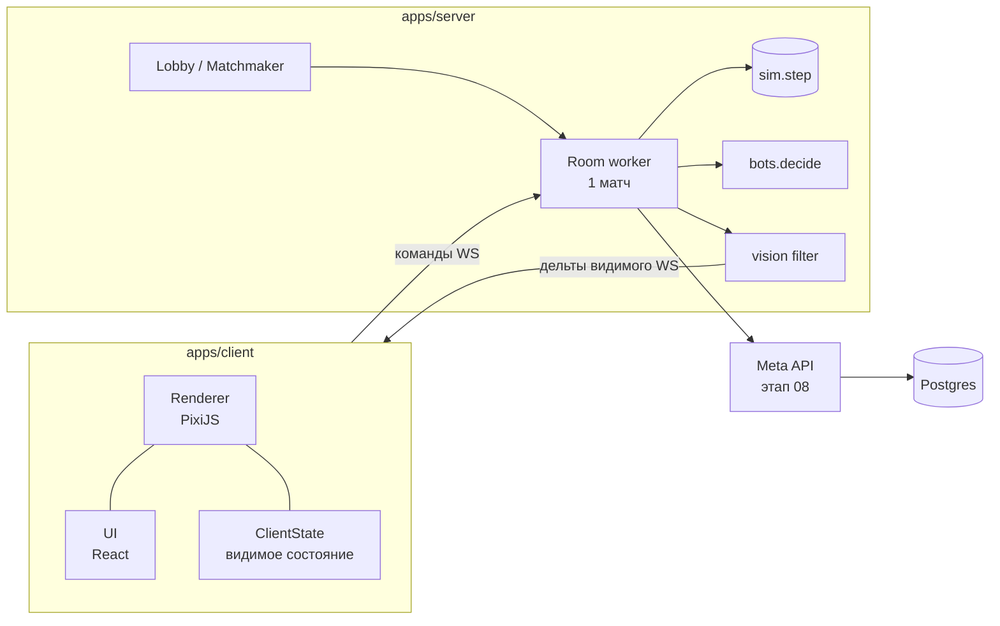

# Архитектура: обзор

## Схема



## Пакеты монорепо

```
packages/
  sim/          чистая детерминированная симуляция; 0 зависимостей
    src/math/   fixed-point, hex-математика, intDiv
    src/rng.ts  seeded PRNG (xoshiro128**)
    src/state/  типы состояния, создание матча из карты
    src/systems/ системы (по одной механике на файл)
    src/commands/ валидация и применение команд
    src/queries/ чистые запросы: forecastBattle, pathfind, playerView
    src/bots/   decide() ботов
    src/balance.ts
  protocol/     типы сообщений, кодек, версия протокола
  mapgen/       генератор процедурных карт, импорт реальных (использует sim/math, rng)
apps/
  server/       Node: ws-сервер, лобби, комнаты в worker_threads, логирование
  client/       Vite + PixiJS v8 + React 19
    src/render/ слои карты, глифы, камера
    src/ui/     React-компоненты HUD/карточек
    src/net/    соединение, интерполяция
    src/local/  локальный режим: sim в Web Worker (оффлайн против ботов, dev)
tools/
  balance/      headless-прогон матчей ботов, отчёт метрик
  replay/       воспроизведение и проверка хэшей
```

## Границы (проверяются dependency-cruiser)

| Пакет | Может импортировать |
| --- | --- |
| `sim` | ничего |
| `protocol` | `sim` (только типы) |
| `mapgen` | `sim` |
| `server` | `sim`, `protocol`, `mapgen` |
| `client` | `sim` (queries, типы, local-режим), `protocol` |
| `tools/*` | всё |

## Ключевые решения

- Один язык TypeScript везде — одна симуляция на сервере, в ботах, в локальном режиме клиента и в инструментах баланса (ADR-0001).
- Сервер авторитетный, клиент получает только видимое (туман нельзя обойти) (ADR-0002).
- Симуляция на целых числах (fixed-point), детерминизм проверяется хэшами (ADR-0003).
- Web-first, мобайл через Capacitor (ADR-0004).
- PixiJS для карты, React только для UI поверх (ADR-0005).
- Состояние — структуры массивов с id, без ECS-библиотек (ADR-0006).

## Локальный режим — с первого этапа

До появления сервера (этап 06) клиент гоняет `sim` в Web Worker против ботов. Это даёт играбельную версию рано, плейтесты без инфраструктуры и тот же код, что на сервере.
