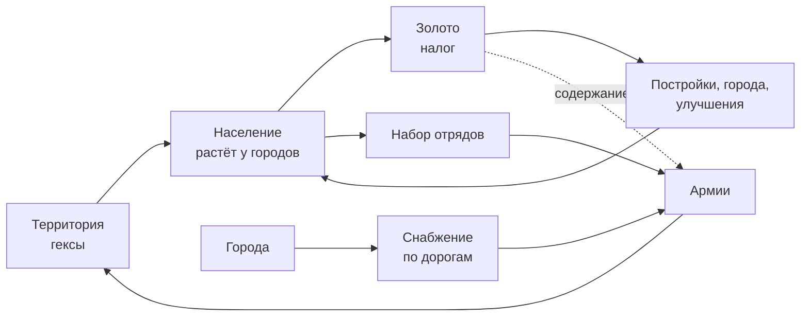

# GDD 00 — Обзор

## Игровой цикл

Игрок постоянно балансирует: **налог** (золото сейчас vs рост потом), **армия vs экономика** (солдаты забирают людей и золото на содержание), **экспансия vs снабжение** (армия дальше от дорог — слабее).

## Глоссарий (единые термины в коде и UI)

| Термин (UI) | В коде | Определение |
| --- | --- | --- |
| Гекс | `Hex` | Клетка карты, осевые координаты `(q, r)` |
| Территория | `owner` | Какому игроку принадлежит гекс (или `NEUTRAL`) |
| Население | `pop` | Люди в гексе, fixed-point |
| Лимит населения | `popCap` | Максимум людей в гексе |
| Налог | `taxRate` | 0–40 %, задаёт игрок |
| Золото | `gold` | Запас игрока |
| Город | `City` | Гекс с городом, уровень 1–5 |
| Столица | `capital` | Особый город, корень сети снабжения |
| Благоустройство | `improvement` | Уровень 0–3 обычного гекса |
| Постройка | `building` | Укрепление или склад, одна на гекс |
| Дорога | `road` | Свойство гекса, соединяет соседние дорожные гексы |
| Сеть снабжения | `SupplyNetwork` | Компонента связности дорог+городов одного игрока |
| Изолированный город | `isolated` | Город, чья сеть не содержит столицу |
| Отряд | `Unit` | Однотипная фишка на карте с числом солдат |
| Армия | `Army` | Группа отрядов игрока с названием; получает фронт и стрелки (CR-001) |
| Тип войск | `UnitType` | `infantry`, `armor`, `artillery` |
| Организованность | `org` | 0–100, «боевой дух»; при 0 отряд отступает |
| Снабжённость | `supplyLevel` | 0–100 % для отряда |
| Фронт | `Front` | Граница с конкретным врагом |
| Котёл | — | Отряды без снабжения, без пути отступления |
| Ополчение | `militia` | Пассивная оборона города без отрядов |

## Темп матча (цели баланса, проверяются ботоматчами)

| Минута | Что должно происходить |
| --- | --- |
| 0–3 | Гонка за нейтральной землёй; к 3:00 ≥ 80 % нейтральных гексов заняты |
| 3–6 | Захват нейтральных городов, первые пограничные стычки |
| 6–15 | Фронты, наступления, котлы; выбывают слабые |
| 15–20 | Развязка: у лидера ≥ 40 % городов |
| 25:00 | Жёсткий таймер, победа по очкам |

Средняя длительность матча: **18–22 мин** `[ТЮНИНГ]`.
