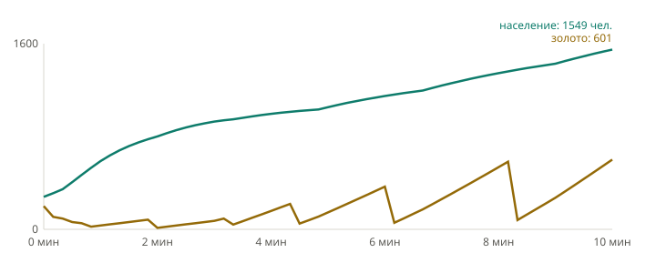

# Отчёт: этап 02 — Территория, экономика, города, снабжение

Ветка `stage-02`, 2026-09-24 — 2026-09-25.

## Задачи

| Задача | Итог | Главное |
| --- | --- | --- |
| T1. `balance.ts` | выполнено в 01/T4 | Все константы `10-balance.md`, тест сверяет имена с документом |
| T2. Налог | готово | `taxSystem`: инерция 2 п. п./с (2 FP за тик); `setTax` — 0–40 % с шагом 5 %, отказ `invalidTaxRate`; множитель роста 1,4/1,0/0,5 при 0/20/40 % |
| T3. Население | готово | Рост в радиусе 2 своих городов, максимум по городам, уровень, благоустройство, налог, изоляция ×0,75, насыщение к лимиту, убыль 1 %/с сверх лимита; инвариант «нет создания из ничего» (fast-check) |
| T4. Доход | готово | Налог с населения, 0,5 × уровень за город, 1/с за шахту; изоляция ×0,5. Стартовый доход на `small` — **1,06 золота/с** (приёмка ±5 %) |
| T5. Стройки | готово | `foundCity`, `upgradeCity`, `improve`, `build(fort/depot)`: все условия `03-cities-buildings.md` с причинами отказа, золото при запуске, прогресс в тиках, отмена при потере гекса без возврата |
| T6. Дороги | готово | Авто-дорога после основания города: Дейкстра по своей земле (веса местности, вода и горы без перевала непроходимы) к ближайшему городу основной сети, 1,5 с/гекс; `findRoadPath` |
| T7. Сети | готово | `networkSystem`: компоненты узлов, основная — со столицей, пересчёт игрока i в тике `tick % 10 == i % 10`. Разрез дороги → изоляция ≤ 10 тиков, восстановление → основная сеть |
| T8. Перестройка снабжения | готово | Путь до любого узла основной сети, 15 золота × гексов без дороги, 1,5 с/гекс; отказы `notIsolated`, `noPath`, `alreadyBuilding`, `notEnoughGold`; повтор — только после отмены прокладки |
| T9. Запросы для UI | готово | `canFoundCity`, `cityInfo` (все поля карточки города), `rebuildSupplyPreview` (путь, цена, `affordable`) |
| T10. Локальный режим, `/dev/economy` | готово | `playerView`; sim в Web Worker, снимок 10 раз/с; страница: территории, города, дороги (изолированные — пунктиром), выбор гекса, карточка города, кнопки строек, ползунок налога. Временный вид, не финальный стиль |
| T11. HUD и карточка по `ui.md` | готово | По замечаниям владельца 2026-09-25: верхняя полоса (люди и золото с приростом, налог с ползунком и подсказкой итога, снабжение, время, место по очкам), карточка снизу слева только с доступными действиями, прогресс строек (строка, полоса, дуга на карте), дороги пунктиром по дереву связей без треугольников, изолированные — серые; три знака города с переключателем на выбор |

## «Готово, когда»

- **Сценарии `testing.md`** (без армий): налог 0/20/40 → 1,4/1,0/0,5; инерция налога; дистанция 3 — отказ, 4 — ок; население 59 % — отказ; разрез единственной дороги → изоляция ≤ 1 с; обход по своей территории → `rebuildSupply` восстанавливает связь — зелёные. Банкротство, захват городов, потеря столицы, снабжение армий — этап 03.
- **Golden-реплей** «10 минут развития без войны» на `small` (сид 42, 2 игрока): хэш `e334c901`, все команды сценария допустимы, повторный прогон совпадает.
- **График** населения и золота игрока 0 — ниже.

## График: 10 минут развития



Данные — `stage-02/development.csv` (шаг 10 с), построены `pnpm --filter @hexfront/replay chart`. Население 280 → 1549 чел., золото 200 → 601. Зубцы золота — покупки улучшений столицы и благоустройства; налог 0 % первые 3 минуты заметен по пологому золоту и крутому росту населения.

**Вывод для баланса:** без армий территория не растёт (захват — этап 03), и в стартовых 3 гексах нет места для нового города (дистанция ≥ 4). Основание городов в реальном матче становится доступно только после экспансии армиями — проверить на ботоматчах этапа 05.

## Решения владельца в этапе

`DECISIONS.md` за 2026-09-24: правила строек (одна стройка на гекс, N при оплате, дистанция до строящихся городов, отмена любой стройки); налог гекса ×0,5 только если все свои города в радиусе 2 изолированы; тестовые изменения состояния — только через DSL; повторная перестройка — только после отмены; golden-хэши старта (`3e62ed9b` → `73da72f7`, новые поля состояния) и реплея. За 2026-09-25: дороги — пунктир, изолированные — серые; знак города — 3 кандидата на выбор; карточка — только доступные действия; HUD перенесён в 02/T11; налог остаётся плавным; укрепление и склад остаются.

## Отклонено или перенесено

- Условие «стройка в бою / рядом с вражеской армией», содержание армий, банкротство, захват и выработка 25 % → 100 %, перенос столицы — этап 03 (по формулировке задач).
- Адаптив HUD для телефона — «Место» переносится на третью строку; доводка — 04/T7.
- Отладочная команда `debugSetOwner` заменена помощником DSL `setOwner` (`testing.md`).

## Скриншоты (просмотрены)

- `stage-02/economy-1440x900.png` — вся карта, выбрана столица: HUD, карточка города.
- `stage-02/economy-1440x900-zoom.png` — масштаб 1,8, свой гекс, раскрыт ползунок налога с подсказкой.
- `stage-02/economy-390x844.png` — телефон: HUD в 2–3 строки (адаптив доводится в 04/T7), карточка внизу.
- `stage-02/economy-city-houses.png`, `stage-02/economy-city-shield.png` — варианты знака города (круг — на остальных).

## `pnpm check`

```
typecheck — ok; eslint + prettier — ok
✔ no dependency violations found (126 modules, 368 dependencies cruised)
tokens: up to date
Tests  205 passed (205)
Покрытие packages/sim: строки ≈ 96 %
```

## Открытые вопросы

- Выбор знака города (круг / домики / щит) — переключатель на `/dev/economy`.
- `QUESTIONS.md`: состав локального матча (2 игрока, соперник без действий), отладочное поле роста в `playerView`.
- `CHANGELOG-proposals.md`: синие цвета игроков против воды.

## Известные риски

- `networks` — кэш с задержкой до 1 с: новый город до первого пересчёта считается связанным (изоляция не штрафует ≤ 1 с).
- Рост и доход усекаются каждый тик (fixed-point): систематическая потеря < 1 FP за тик на гекс; при балансе учитывать.
- Производительность `step` на 30 игроках не измерялась (бенчмарк — этап 05); `isolatedHexes` и рост считают окрестности городов каждый тик.
- После перезаписи файлов (rebase) Vite однажды перестал отдавать `/maps/*`; помог перезапуск dev-сервера.
